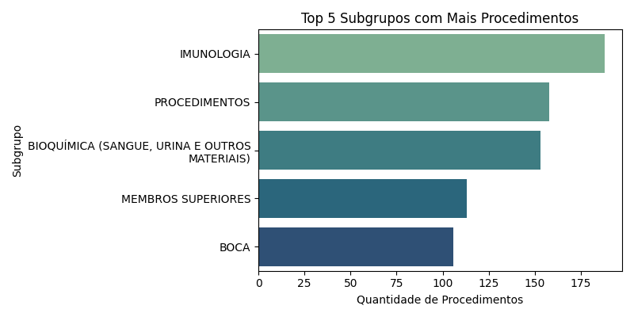
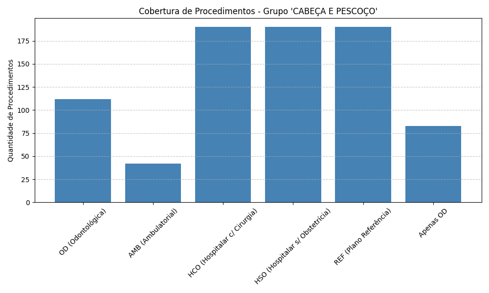
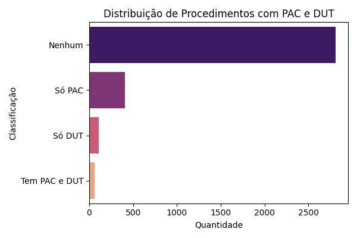

# Análise do Rol de Procedimentos da ANS

Este projeto realiza uma análise exploratória do Rol de Procedimentos e Eventos em Saúde da ANS, com o objetivo de gerar **insights visuais** sobre os procedimentos cobertos pelos planos de saúde no Brasil.

---

## 📊 Gráfico 1: Top 5 Subgrupos com Mais Procedimentos

Esse gráfico mostra os cinco subgrupos com maior quantidade de procedimentos listados no Rol da ANS.

**Insight:** O subgrupo *Imunologia* lidera em número de procedimentos, seguido por *Procedimentos gerais* e *Bioquímica*.

---

## 🦷 Gráfico 2: Cobertura no Grupo "Cabeça e Pescoço"

Aqui analisamos quais tipos de plano cobrem procedimentos do grupo **Cabeça e Pescoço**, com destaque para os exclusivamente odontológicos.

**Insight:** Muitos procedimentos são cobertos apenas por planos odontológicos (`OD`), o que evidencia sua segmentação.

---

## 🧪 Gráfico 3: Associação PAC/DUT

Esse gráfico (gerado em `analise_rol_ans.py`) mostra a presença ou ausência de associação entre **PAC** (Protocolo de Atenção Clínica) e **DUT** (Diretriz de Utilização).

**Insight:** Um número considerável de procedimentos não possui associação clara com PAC ou DUT, o que pode impactar a regulação.

---

## 🛠️ Ferramentas Utilizadas

| Ferramenta | Finalidade | Onde foi utilizada |
|------------|------------|--------------------|
| **Python** | Linguagem principal de análise e automação | Todos os scripts `.py` |
| **Requests** | Download automático de PDF da ANS | `web_scraping.py` |
| **BeautifulSoup** | Extração de links da página da ANS | `web_scraping.py` |
| **pdfplumber** | Extração de tabelas do PDF | `extrair_pdf.py` |
| **Pandas** | Manipulação e análise de dados | `analise_rol_ans.py`, `odonto.py` |
| **Matplotlib** | Geração de gráficos de barras | `analise_rol_ans.py`, `odonto.py` |
| **Seaborn** | Visualizações estilizadas com paleta de cores | `analise_rol_ans.py`, `odonto.py` |
| **Jupyter/VSC** | Desenvolvimento e testes dos scripts | Localmente, durante o desenvolvimento |

Todas as ferramentas utilizadas estão dentro das **regras do desafio do CASE RAITec 2025.1**, incluindo o uso obrigatório de Python e bibliotecas livres para análise de dados.

---

## 📁 Arquivos principais

- `web_scraping.py`: faz o download do PDF do site da ANS
- `extrair_pdf.py`: extrai as tabelas do PDF
- `rol_extraido.csv`: base final usada na análise
- `analise_rol_ans.py`: gera gráficos gerais (PAC, DUT, subgrupos, odonto x outras áreas)
- `odonto.py`: análise específica para o grupo "Cabeça e Pescoço" com foco em planos odontológicos

---

## 👥 Participantes

- Maria Paula Mesquita Silva Saraiva  
- João Victor Jorge Almeida Benevides  
- Vitória Lima Albuquerque  
- Gustavo Silveira Alcântera  

Projeto desenvolvido para o **CASE RAITec 2025.1**.
